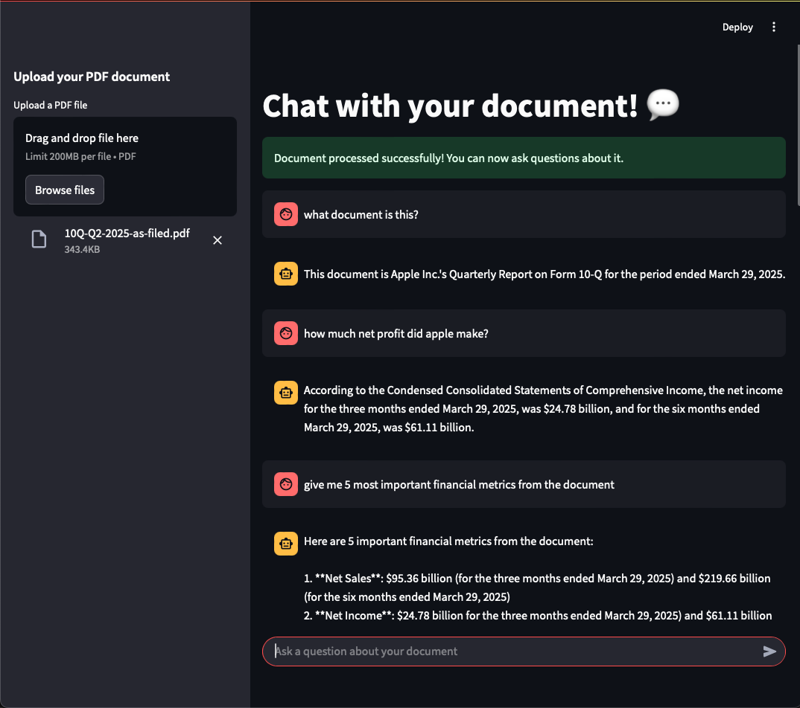
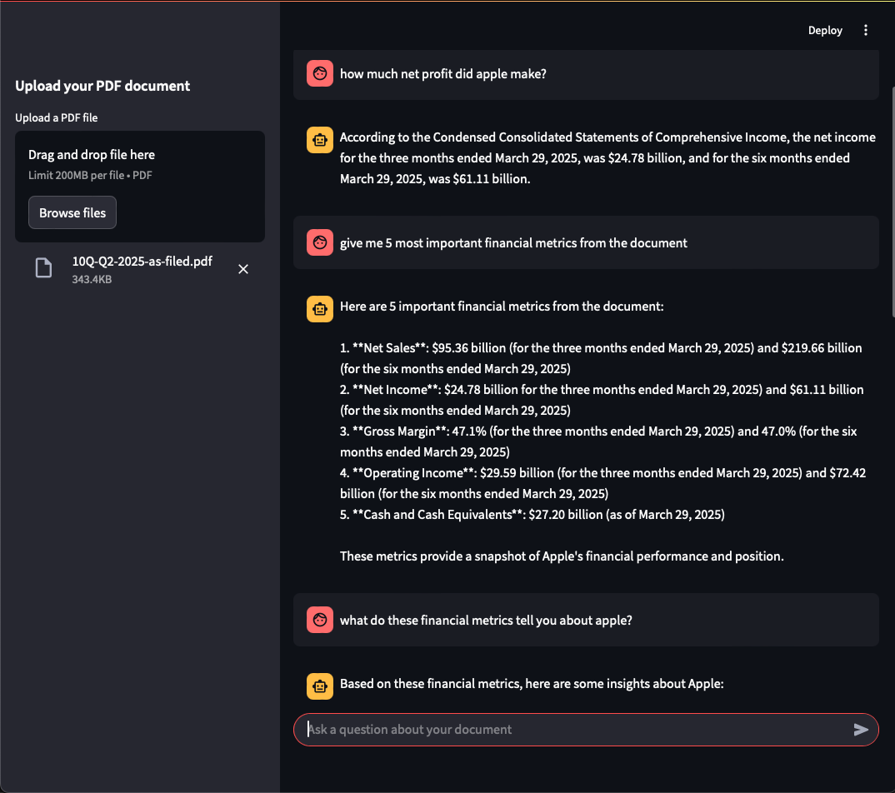
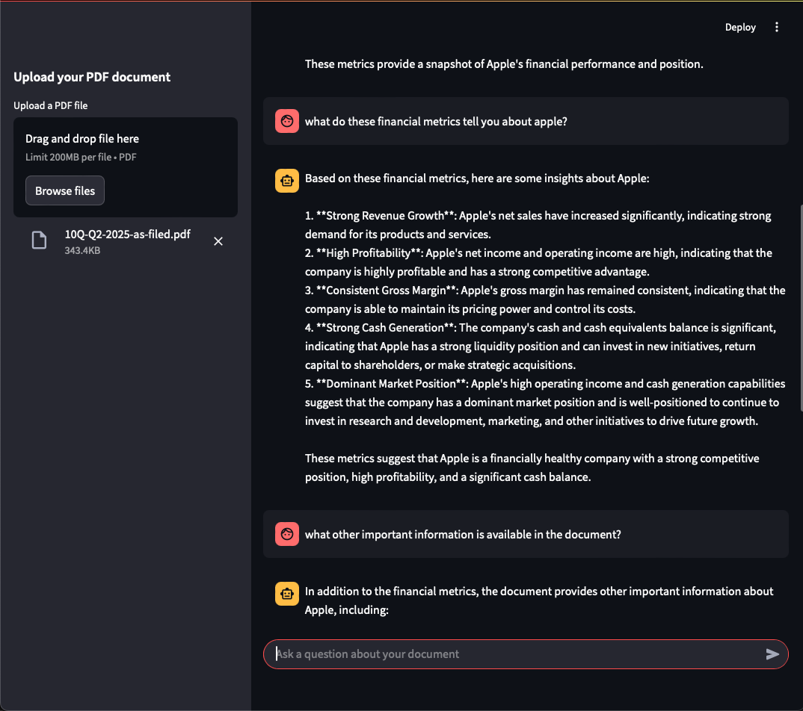
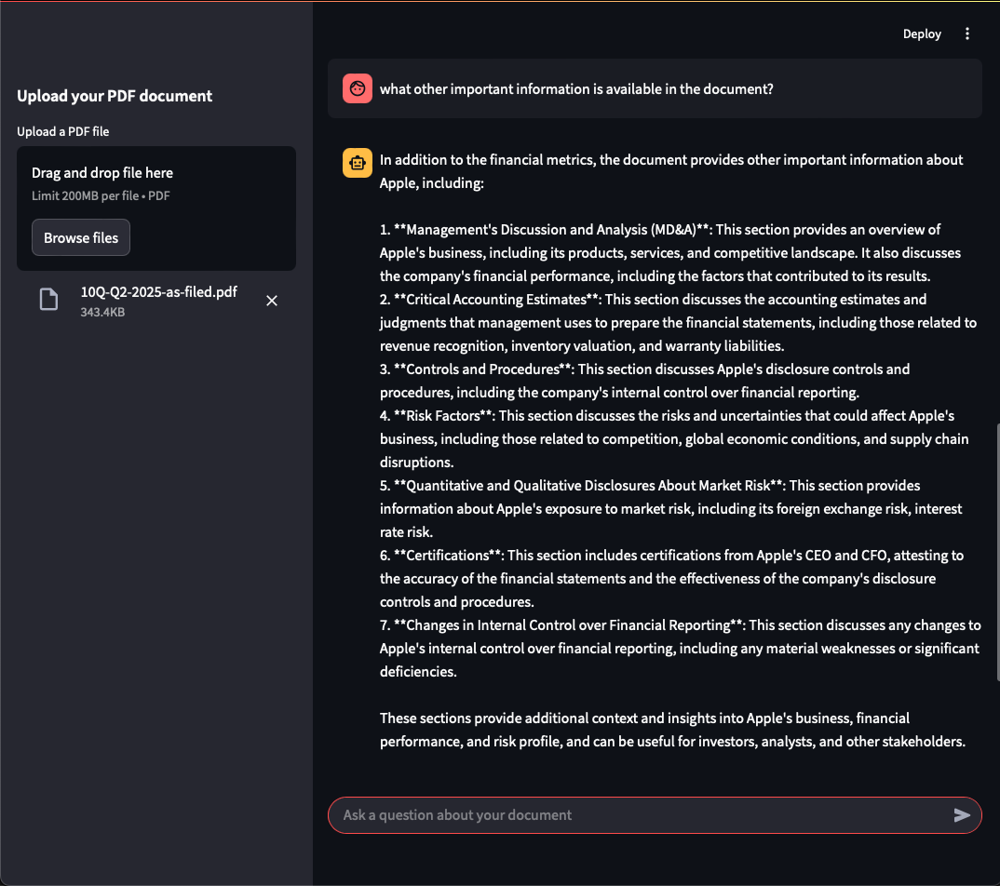
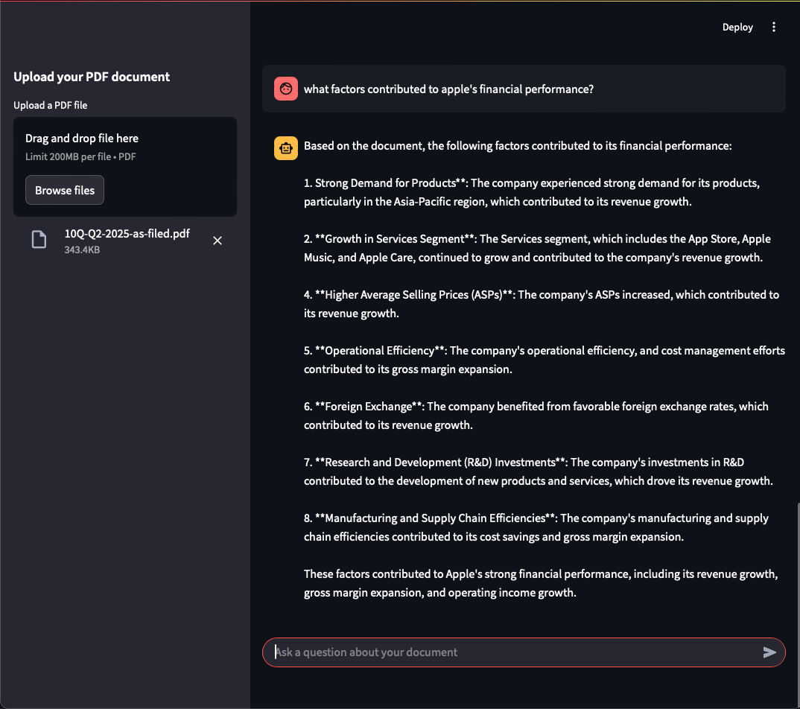

# 🖥️ Web App Overview
This is a simple **RAG Web App** where the user can have a *conversation with their document*.
In the example below, I used Apple Inc.'s 20205 Q2 10-Q document.

# 🦙 The LLM
My LLM of choice was **llama3-70b-8192** via [Groq](https://console.groq.com/docs/models)
